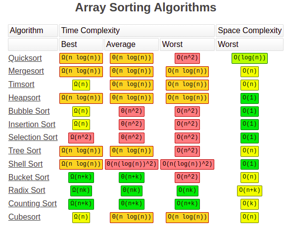
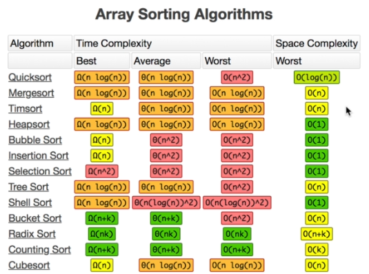
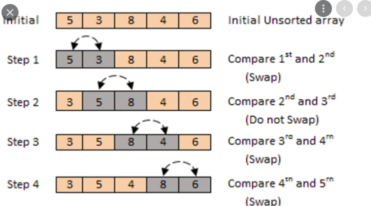
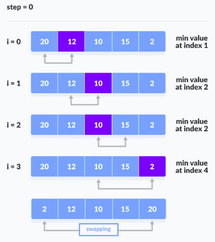
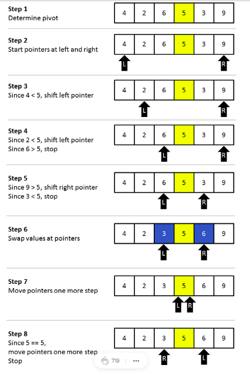
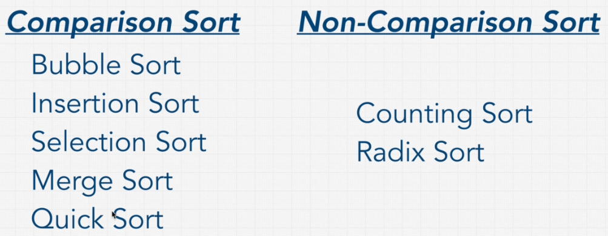

## Guidelines

[click here](https://coggle.it/diagram/W5E5tqYlrXvFJPsq/t/master-the-interview-click-here-for-course-link)  to see live version

Best site for visualize data structure and algorithms : [visualAlgo](https://visualgo.net/en/list)

##Big O Cheat Sheet:
#### -Big Os-
[bigocheatsheet](https://www.bigocheatsheet.com/)

`O(1)` Constant- no loops

`O(log N)` Logarithmic- usually searching algorithms have log n if they are sorted (Binary Search)

`O(n)` Linear- for loops, while loops through n items

`O(n log(n))` Log Liniear- usually sorting operations

`O(n^2)` Quadratic- every element in a collection needs to be compared to ever other element. Two
nested loops

`O(2^n)` Exponential- recursive algorithms that solves a problem of size N

`O(n!)` Factorial- you are adding a loop for every element

- Iterating through half a collection is still O(n)
- Two separate collections: O(a * b)

**What can cause time in a function?**

- Operations (+, -, *, /)
- Comparisons (<, >, ==)
- Looping (for, while)
- Outside Function call (function())

**-Rule Book-**

- Rule 1: Always worst Case
- Rule 2: Remove Constants
- Rule 3: Different inputs should have different variables. O(a+b). A and B arrays nested would be
O(a*b)

`+` for steps in order

`*` for nested steps

- Rule 4: Drop Non-dominant terms

**-What causes Space complexity?-**

- Variables
- Data Structures
- Function Call
- Allocations

### Singly Linked List 

### Doubly linked list 

- singly linked list is useful for insertion and deletion, because singly linked list need less memory compared to doubly linked list. 

- doubly linked list is useful for traverse and searching.  

### stack

pick() method just pick top element.

**Array will be suitable for stack implementation**

### queue

here pick() method just pick first element. 

**Linked list will be the best suitable for queue implementation, because when we enqueue or dequeue an element from an array,
 then all element should be shifted from its original position. It will cost O(n) time complexity on the other hand Linked list will cost O(1) time complexity, but it will take some memory.**
 
 ### Tree
 
 In binary search tree values which are less than root node exist in left tree and bigger values are exist in right. 
 
 **Balanced binary search tree**
 
 binary search trees value are already in sorted order.
 
 **Unbalanced binary search tree**
 
 Balanced binary search tree gives us O(log N) complexity but unbalanced tree gives us O(n) time complexity but some algorithms help us to reduce complexity.
 
 AVL tree, Red-Black tree, B-tree algorithms turned unbalanced to balanced tree when insertion, then complexity reduced to O(log N)
 
 **Big O complexity chart**
 
 
**Time complexity chart**

**array complexity cheatsheet**

**Binary Heep**
room value is greater than total of child element value or vise versa. Insertion will happen from left to right. If insertion value break the rule then rearrange this heep. 

**priority queue**
queue works like first in first out, In priority queue each node has some weight, which will prioritize to out, like if some VIP comes in a line then he/she will be out first. 

**trie**
tries works in google search. trie help us find a word or part of a word exist in body of text. 

 
### Graph
**All those are graph**

**graph edge vertex**

**graph weighted**

**directed graph**

**cyclic graph**
 

**graph visual details**

**graph code**

**recursion**

**fibonacci**

**all algorithms**

## sorting

almost 5 sorting algorithm are most useful, those are - 
- Bubble sort
- Insertion sort
- Selection sort
- Merge sort
- Quick sort

Quick sort and merge sort are most popular than others because 
they have `O(n logn)` complexity that are better than `O(n^2)`

**Bubble sort**

**selection sort**

**insertion sort**
If items are being almost sorted then insertion time complexity will be O(n).

merge and quick sort used Divide and conquer technique to reduce time complexity to O(n log n)

**merge sort**

**quick sort**
Elements to the left of the pivot are smaller and right of the pivot are greater. 

#### When to use which sorting algorithms ?

- Insertion sort should be used only for few items or items are being almost sorted then insertion sort quick faster. 
- Never use Bubble sort and selection sort, only for use learning purposes, because it's never very efficient, time complexity `O(n^2)`.
- merge and quick sort are most used sorting algorithms, If space complexity will be concern then quick sort will be good choice, because its space complexity is `O(log n)` 
- Heep sort is best because its time complexity is `O(n log n)` and space complexity is `O(1)`

**Count and Radix sort**

we can reduce time complexity from `O(n log n)` to `O(n)` by using counting or Radix sort because both are not comparison sorting algorithms, thy store the values in 0 or 1.

1. Sort 10 schools around your house by distance: `insertion sort`

2. eBay sorts listings by the current Bid amount: `radix or counting sort`
3. Sort scores on ESPN : `Quick sort`

4. Massive database (can't fit all into memory) needs to sort through past year's user data : `Merge Sort`

5. Almost sorted Udemy review data needs to update and add 2 new reviews: `Insertion Sort`

6. Temperature Records for the past 50 years in Canada : 
`radix or counting Sort, 
Quick sort if decimal places`

7. Large user name database needs to be sorted. Data is very random : 
`Quick sort`

8. You want to teach sorting : 
`Bubble sort`

## Searching

**search and traversal**
1. Linear search
2. Binary search
3. Depth first search
4. Breadth first search

**Linear search**
Searching element one by one

`indexOf()`, `findIndex()`, `find()` and `includes()` methods used linear search.

If data stored in sorted array then Bubble sort will be most efficient because Linear search take O(n) time complexity on the other hand Bubble sort take O(log n) time complexity.

