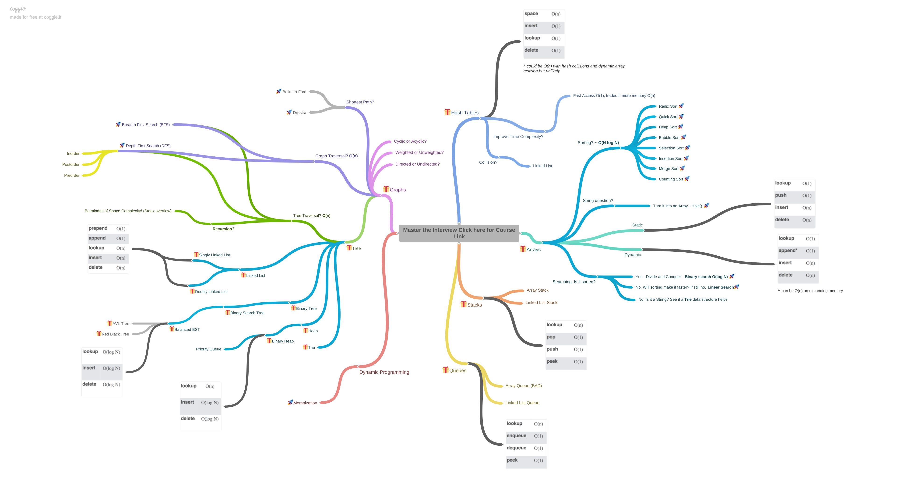
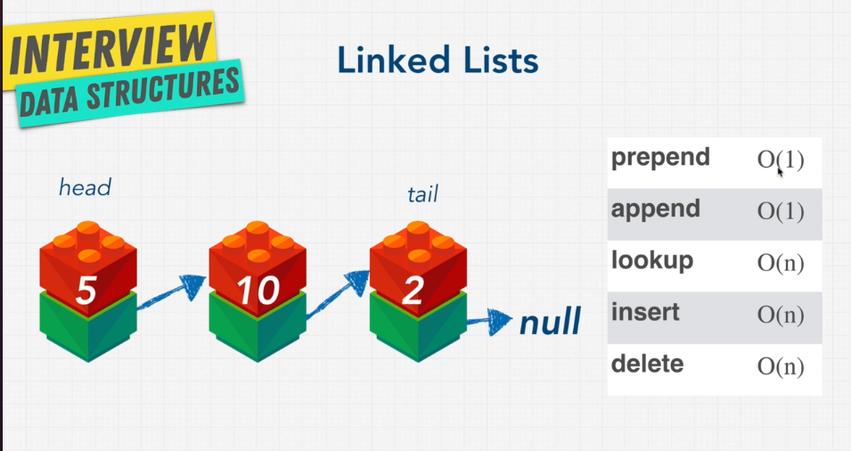
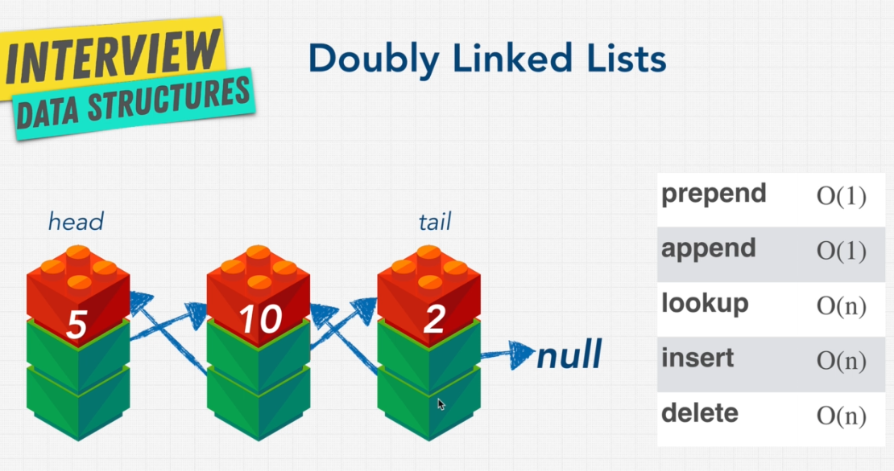

## Guidelines

[click here](https://coggle.it/diagram/W5E5tqYlrXvFJPsq/t/master-the-interview-click-here-for-course-link)  to see live version

Best site for visualize data structure and algorithms : [visualAlgo](https://visualgo.net/en/list)

### Singly Linked List 

### Doubly linked list 

singly linked list is useful for insertion and deletion, because singly linked list need less memory compared to doubly linked list. 
doubly linked list is useful for traverse and searching.  
