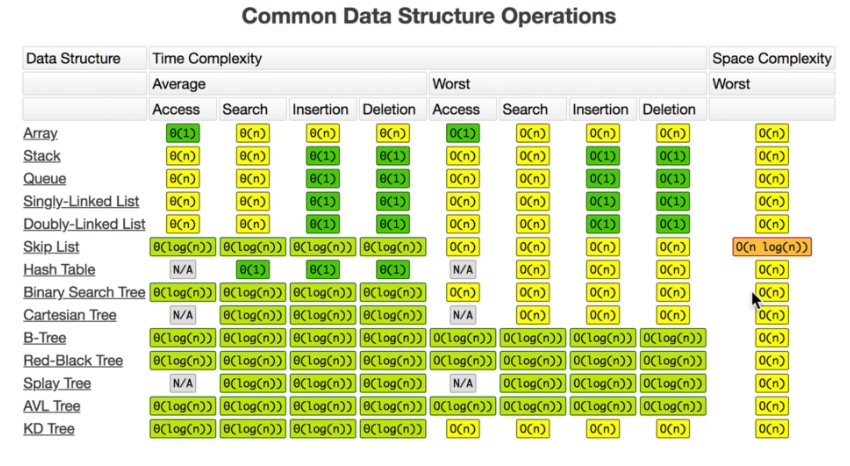

## Guidelines

[click here](https://coggle.it/diagram/W5E5tqYlrXvFJPsq/t/master-the-interview-click-here-for-course-link)  to see live version

Best site for visualize data structure and algorithms : [visualAlgo](https://visualgo.net/en/list)

##Big O Cheat Sheet:
#### -Big Os-
`O(1)` Constant- no loops

`O(log N)` Logarithmic- usually searching algorithms have log n if they are sorted (Binary Search)

`O(n)` Linear- for loops, while loops through n items

`O(n log(n))` Log Liniear- usually sorting operations

`O(n^2)` Quadratic- every element in a collection needs to be compared to ever other element. Two
nested loops

`O(2^n)` Exponential- recursive algorithms that solves a problem of size N

`O(n!)` Factorial- you are adding a loop for every element

- Iterating through half a collection is still O(n)
- Two separate collections: O(a * b)

**What can cause time in a function?**

- Operations (+, -, *, /)
- Comparisons (<, >, ==)
- Looping (for, while)
- Outside Function call (function())

**-Rule Book-**

- Rule 1: Always worst Case
- Rule 2: Remove Constants
- Rule 3: Different inputs should have different variables. O(a+b). A and B arrays nested would be
O(a*b)

`+` for steps in order

`*` for nested steps

- Rule 4: Drop Non-dominant terms

**-What causes Space complexity?-**

- Variables
- Data Structures
- Function Call
- Allocations

### Singly Linked List 

### Doubly linked list 

- singly linked list is useful for insertion and deletion, because singly linked list need less memory compared to doubly linked list. 

- doubly linked list is useful for traverse and searching.  

### stack

pick() method just pick top element.

**Array will be suitable for stack implementation**

### queue

here pick() method just pick first element. 

**Linked list will be the best suitable for queue implementation, because when we enqueue or dequeue an element from an array,
 then all element should be shifted from its original position. It will cost O(n) time complexity on the other hand Linked list will cost O(1) time complexity, but it will take some memory.**
 
 ### Tree
 
 In binary search tree values which are less than root node exist in left tree and bigger values are exist in right. 
 
 **Balanced binary search tree**
 
 binary search trees value are already in sorted order.
 
 **Unbalanced binary search tree**
 
 Balanced binary search tree gives us O(log N) complexity but unbalanced tree gives us O(n) time complexity but some algorithms help us to reduce complexity.
 
 AVL tree, Red-Black tree, B-tree algorithms turned unbalanced to balanced tree when insertion, then complexity reduced to O(log N)
 
 **Big O complexity chart**
 
 
**Time complexity chart**

**Binary Heep**
room value is greater than total of child element value or vise versa. Insertion will happen from left to right. If insertion value break the rule then rearrange this heep. 

**priority queue**
queue works like first in first out, In priority queue each node has some weight, which will prioritize to out, like if some VIP comes in a line then he/she will be out first. 

**trie**
tries works in google search. trie help us find a word or part of a word exist in body of text. 

 
### Graph
**All those are graph**

**graph edge vertex**

**graph weighted**

**directed graph**

**cyclic graph**
 

**graph visual details**

**graph code**

**recursion**

**fibonacci**

**all algorithms**
